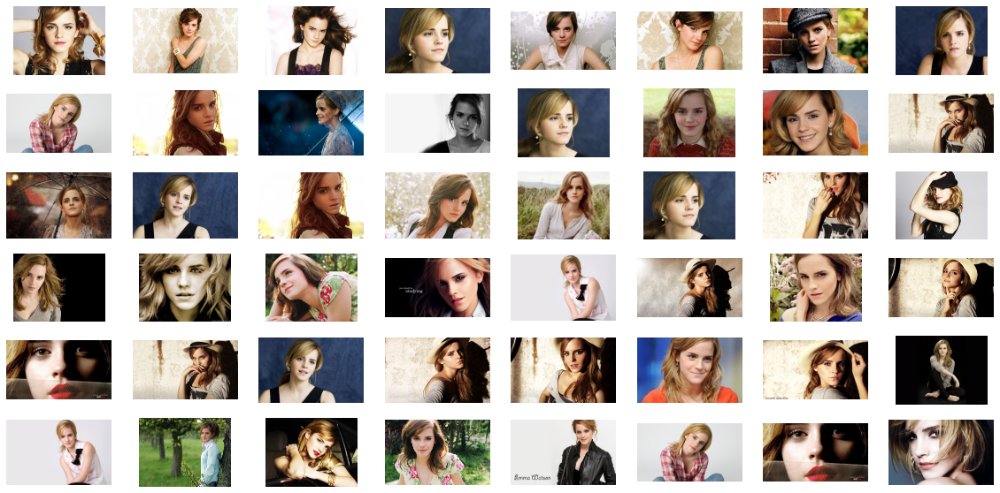

# Image-lens
A GUI app made in tkinter ,to search similar image related to a particular image
We have made a app to find similar image to a given image among the list of images 
<h2>libraries:</h2>
<ul>
  <li>Tensorflow 2.x</li>
  <li>Scikit learn</li>
  <li>numpy</li>
  <li>Matplotlib</li>
  <li>PyQt5</li>
  <li>Tkinter</li>
  
</ul>

<h2>Algorithm</h2>
<h5>We have taked 2 pretrained models 1.Inceptionnet_v3 2.VGG .with their classification layer removed</h5>
<ul><li>In first case we pass both the search image and target images through the model and find the cosine similarity matric between the output</li>
<li>In VGG we introduced  customization through outputing middle layers along with final layer to extract style.so we can filter the search result with style similarity and content similarity .The example depicted below is using style extraction using this model
</li></ul>
#for ex:this is search_image

<h3>this are the target images:</h3>
 

<h3>And we get the result as this search result:</h3>
 
