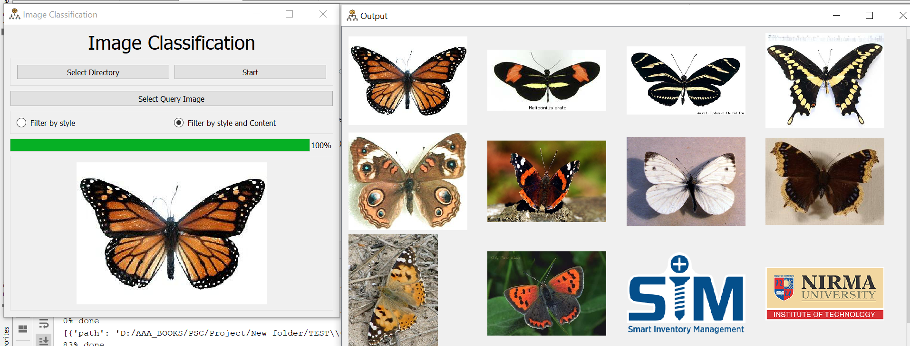

# Image-lens
A GUI app made in PyQt5 ,to search similar image related to a particular image
We have made a app to find similar image to a given image among the list of images 

<h2>libraries:</h2>
<ul>
  <li>Tensorflow 2.x</li>
  <li>Scikit learn</li>
  <li>numpy</li>
  <li>Matplotlib</li>
  <li>PyQt5</li>
  
</ul>

<h2>Algorithm</h2>
<h5>We have taked 2 pretrained models 1.Inceptionnet_v3 2.VGG .with their classification layer removed</h5>
<ul><li>In first case we pass both the search image and target images through the model and find the cosine similarity matric between the output</li>
<li>In VGG we introduced  customization through outputing middle layers along with final layer to extract style.so we can filter the search result with style similarity and content similarity .The example depicted below is using style extraction using this model
</li></ul>

<h3>this is the target image:</h3>

<h2>How to use</h2>
<h5>
  <ul>
  <li>In this App you can select directory where all the input data images are present</li>
    <li>Afterwards select query image or target image by clicking 'select query image' button</li>
    <li>Select option among filter by style or filter by style and content both, filter by style and content is more accurate as well as somewhat time consuming</li>
    <li>Click on start button</li>
    <li>After few seconds output window will show the output</li>
    <li>This will have matching images to the query image in the decreasing order of matching</li>
  </ul>
  <h5>

<h3>And we get the result as this search result:</h3>
 
